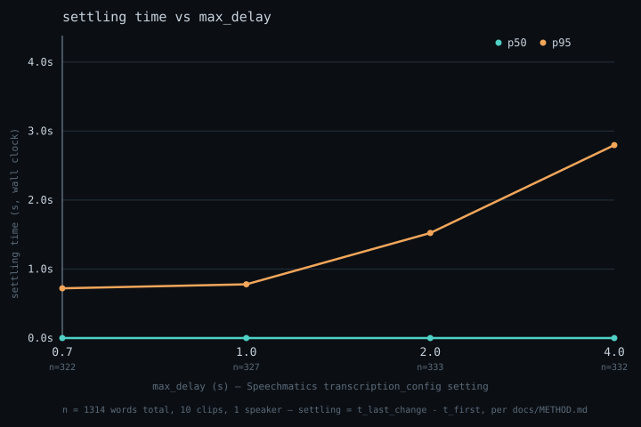

# SETTLE

**Streaming ASR tells you what it heard. Nothing tells you when it stopped changing.**

Speechmatics track · AI Infra Summit Hackathon 2026

---

Streaming speech recognition emits partial hypotheses that get revised. A word
can appear, look settled, and still be rewritten up to 0.774s later — the
measured p95 in this repository's own corpus at `max_delay=1.0`. Anything
downstream that acts on the stream — an agent, a command handler, a dispatch
console — has already acted.

Vendors publish word error rate and latency. Both describe endpoints. Neither
describes the interval in between, where the text is visible, plausible, and
still moving. That interval has no published number.

SETTLE measures it, then holds it.

## Two parts

**The instrument.** Streams a fixed clip at real-time pace, records every
inbound message with its arrival timestamp, and computes per-word **settling
time** — how long a word kept being revised after it first appeared. Every clip
is swept across `max_delay` ∈ {0.7, 1.0, 2.0, 4.0} to answer a question the
documentation does not: *does a transcript marked final actually stop changing?*

**The sidecar.** A WebSocket proxy that holds a token until its text has been
stable for τ seconds, then releases it. One upstream connection, two downstream
streams — naive and settled — so the difference is visible on identical input.

τ is a dial, not a switch. It buys correctness with latency, and the instrument
is what tells you the exchange rate.

## Results

Measured on this repository's runs. See `docs/METHOD.md` for definitions and
stated threats to validity.

| `max_delay` | words | settling p50 | settling p99 | words revised | revised after final |
|---|---|---|---|---|---|
| 0.7 | 308 | 0.000s | 0.985s | 32.8% | 0.0% |
| 1.0 | 304 | 0.000s | 1.154s | 33.6% | 0.0% |
| 2.0 | 304 | 0.000s | 1.846s | 41.4% | 0.0% |
| 4.0 | 311 | 0.000s | 3.441s | 45.0% | 0.0% |

This table is pasted from `make results`, never typed. Nothing in it is
estimated. It answers the question the documentation does not: once a word is
reported in an `AddTranscript`, does its text ever change again? Across 1,227
observed words, zero times. Settling p99 scales with `max_delay` by a factor of
3.5x from the shortest to the longest setting — the dial genuinely trades
latency for stability, and the instrument is what shows the exchange rate.



`make chart` regenerates this from `runs/` — see `chart.py`.

## The sidecar

`sidecar.py` holds a word until its text has been stable for **τ**, then
releases it. Default τ = **0.774s** — settling p95 at `max_delay=1.0`, the
Makefile's own default setting. `make measure` reproduces the numbers below
from `runs/`.

| | tokens | residual retraction | added latency p50 | p95 |
|---|---|---|---|---|
| md=1.0 (τ calibrated here) | 307 | 4.2% | 0.774s | 0.774s |
| all four `max_delay` pooled | 1,400 | 13.9% | 0.774s | 1.734s |

τ does not transfer across `max_delay` settings — the same 0.774s that holds
retraction to 2.3% at `max_delay=0.7` lets it climb to 24.9% at `max_delay=4.0`,
because settling simply takes longer there. A deployed sidecar should pick τ
for the `max_delay` it is actually paired with, not reuse one default.
Residual retraction is not a bug to engineer away — `settled_stream()` cancels
a pending release the moment the engine retracts its word, but a release that
already went out can't be recalled. τ trades latency for a *lower*, not a
*zero*, chance of announcing something the engine later takes back.
p50 added latency equalling τ exactly is the same finding as the main table
from a different angle: settling p50 is 0.000s, so most released tokens were
never revised at all — their only wait was τ itself.

## The demo

`make demo` starts the sidecar, runs both consumers against it, and prints
the comparison — no arguments, no setup.

Canonical clip: **`runs/09_md1.0.jsonl`** (clip 09, the background-noise
clip). Locked because it reproducibly shows the naive/settled divergence
end to end: a partial garbles `"working fire me"`, and the naive consumer
fires `ELEVATED - FIRE` — a false alarm — before correcting itself to
`STANDARD` and finally `CRITICAL - RESCUE` once `trapped` locks in. The
settled consumer, reading the same upstream feed with τ = 0.774s, never
sees the false alarm at all; its first and only tier is the correct one.
Verified reproducible across repeated runs against the same replay.

## Run it

```bash
pip install -r requirements.txt
cp .env.example .env          # add your Speechmatics key
export SPEECHMATICS_API_KEY=...

ffmpeg -i clips/call1.m4a -ac 1 -ar 16000 -f s16le clips/call1.pcm

make record CLIP=call1 MD=1.0     # one run
make sweep  CLIP=call1            # all four max_delay values
make analyze                      # settling time across every run
make results                      # the README table, straight from runs/
```

`python analyzer.py --inspect runs/<file>.jsonl` dumps a raw payload if you want
to check the reader against the wire format yourself.

## Layout

```
recorder.py    instrument — observes, never interprets
analyzer.py    settling time, emission lag, revision counts
sidecar.py     WebSocket proxy with the settle policy
consumers.py   naive vs settled dispatch mocks
docs/METHOD.md how the measurement works, and where it is weak
docs/SCOPE.md  timeline, gates, abort rules
docs/PITCH.md  video structure
runs/          recorded sessions — the evidence, kept in the repo
```

## Why the demo is a dispatch call

A retraction has to cost something before the problem is legible. In a
note-taking app a revised word is a typo. In emergency dispatch, this
repository's own locked demo clip (see "The demo" above) shows a partial
misheard as `working fire me`, which fires an `ELEVATED - FIRE` dispatch
tier — a false alarm — before the engine corrects itself. By the time it is
corrected, a naive consumer has already acted on it.

All audio is recorded by the author for this project. No real emergency calls
were used.
